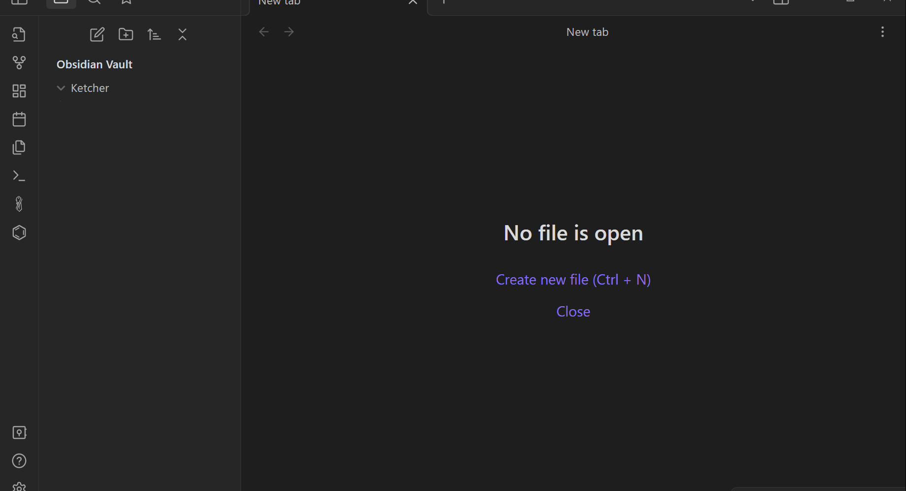

# Obsidian Ketcher

An Obsidian plugin to view or draw chemical structures and reactions using [Ketcher](https://github.com/epam/ketcher), a web-based molecule sketcher.

## How to Use Ketcher

[Ketcher's help document](https://github.com/epam/ketcher/blob/master/documentation/help.md)

## Demo

